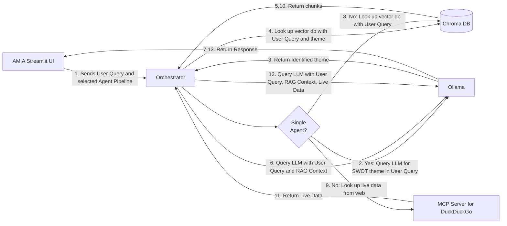

```mermaid
graph LR
A[AMIA Streamlit UI] -->|1. Sends User Query and selected Agent Pipeline|B[Orchestrator] 

%% Check and invoke the correct pipeline %%
B-->C{Single<br/>Agent?}

%% Single Agent Pipeline %%
C-->|2. Yes: Query LLM for SWOT theme in User Query|D[Ollama]
D-->|3. Return Identified theme|B
B-->|4. Look up vector db with User Query and theme|E[(Chroma DB)]
E-->|5,10. Return chunks|B
B-->|6. Query LLM with User Query and RAG Context|D
D-->|7,13. Return Response|A

%% Multi Agent Pipeline %%
C-->|8. No: Look up vector db with User Query|E
C-->|9. No: Look up live data from web|F[MCP Server for DuckDuckGo]
F-->|11. Return Live Data|B
B-->|12. Query LLM with User Query, RAG Context, Live Data|D

```
