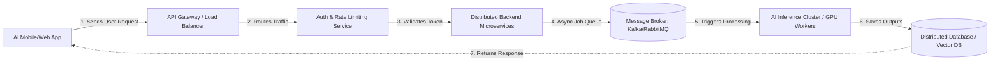

# AMIA

```mermaid
graph LR
    A[AI Mobile/Web App] -->|1. Sends User Request| B[API Gateway / Load Balancer]
    B -->|2. Routes Traffic| C[Auth & Rate Limiting Service]
    C -->|3. Validates Token| D[Distributed Backend Microservices]
    D -->|4. Async Job Queue| E[(Message Broker: Kafka/RabbitMQ)]
    E -->|5. Triggers Processing| F[AI Inference Cluster / GPU Workers]
    F -->|6. Saves Outputs| G[(Distributed Database / Vector DB)]
    G -.->|7. Returns Response| A
```
