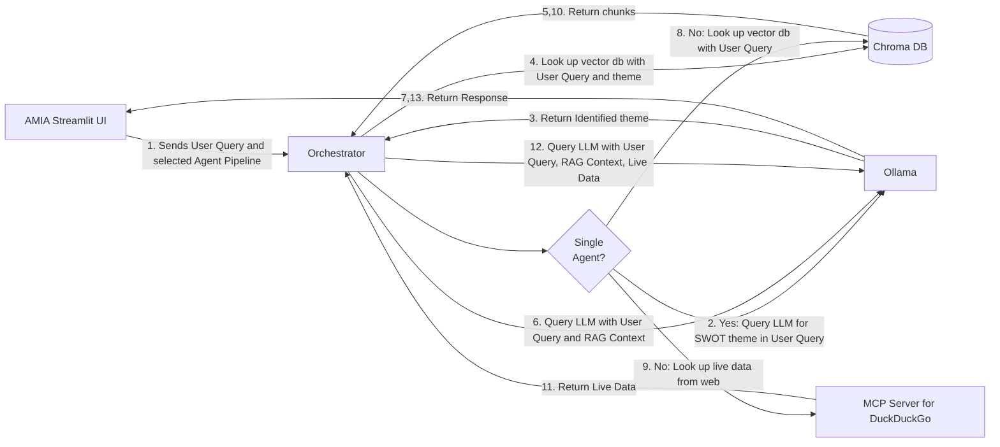

**Case Study: AMIA (AI Market Intelligence Analyst)**

AMIA is an autonomous “Agentic AI Financial Analyst” optimised for the technology sector. It provides corporate SWOT analysis and competitive market intelligence by synthesizing  regulatory filings with real-time web telemetry.

**Architecture and Tech Stack**

System Architecture
AMIA utilizes an “Orchestrator pattern” to manage context assembly and route execution dynamically based on selected agent workflows. The following diagram illustrates the system architecture.

**Tech Stack
**

Python, LangChain, Ollama, ChromaDB, Model Context Protocol (MCP), StreamLit, BGE-M3 embedding

**Application Layer**

Core Model/Backend 
AMIA uses the Llama3.1 (8B) model from Ollama. It is built with 2 agents. 

1. The first agent derives insights from historical data such as company 10-K* and 10-Q* statements, and industry reports like ARKInvest BigIdeas2026 and Responsible AI - Overcoming Adoption Barriers and Risks from McKinsey. This agent uses a RAG pipeline built with LangChain and ChromaDB.

   **Note: *: Currently limited to NVIDIA.**
   
2. The second agent improves the accuracy of the analysis using recent and live data from the internet, implemented using an MCP client and server built with DuckDuckGo.

3. The LLM is then used to combine data from the two agents to provide a well-informed response to a user-query.
   
The choice of tools, particularly the LLM model and DuckDuckGo, was dictated by the requirement to run everything on my Apple laptop (M4, 16 GB) without the need for paid APIs on the Cloud.

**UI/Frontend** 


AMIA uses Streamlit to implement an interactive front-end that takes user queries and displays responses from the backend. It provides features like a choice of agent pipelines, viewing matching chunks from the RAG pipeline, persistence of responses, and a knob to download the responses.

**Data Pipelines**

AMIA offers two different agent pipelines. 


**Single Agent Pipeline using highly optimized RAG**


Employs a Chunking Strategy that uses Hierarchical (Parent-Child) Chunking and metadata insertion based on SWOT themes while generating the vector database (ChromaDB). 

When a user query is received at the Streamlit frontend, it passes it unmodified to the agent pipeline in the back. 
The backend queries the LLM to extract one or more SWOT themes from the user query. 
The user query and the derived themes are then used to generate the embedding used to look up Chroma DB. The top 2 or 3 matching chunks are then passed to the LLM, along with the query. 
The LLM response is fed back to the UI, displayed and persisted by the UI, which also provides a knob for the user to view the contents of the matching chunks.

**Multi Agent Pipeline using RAG and live web lookup**

Employs a simpler chunking strategy for the RAG agent, without Hierarchical Chunking and metadata. Uses a second agent to lookup recent and live data from the web. 

When a user query is received at the Streamlit frontend, it passes it unmodified to the agent pipeline in the back. 
This query is embedded to look up ChromaDB. 
In parallel, the query is fed to the second agent, which uses an MCP client to connect to the MCP server of a DuckDuckGo based web scraping tool. 
The responses from the vector database lookup and the web lookup are combined, using Ollama’s message based chat interface, to look up the LLM. The response is then fed back to the UI. 

**Optimization and R&D Iterations**

RAG pipeline/Chunking Strategy
I went through multiple cycles of test and improvements to optimise the RAG pipeline. Initially, the chunks returned by the vector database exhibited high token-match bias, with generic boiler-plate statements dominating the output. 
I tried different techniques like using query prefixes, re-rankers on top of query prefixes, cross-encoders, and HyDELite with LLM based re-ranker. 
Query prefixes/re-rankers and cross-encoders did not help at all. HydeLite with LLM based ranking offered some improvement but not enough. All of this pointed to incorrect chunking. To address this:


1. I optimized the vector database using Hierarchical chunking, careful choice of parent and child chunk sizes/overlaps, and very importantly, adding theme based metadata to the chunks during database ingestion. During query of the database, themes extracted from the prompt were added to the user query. These changes dramatically improved the quality of the lookup and that of the final response. Here is the paper where I have documented my experiments with the different vector database ingestion and retrieval techniques.
   
2. Extracting the right themes using the LLM, during ingestion as well as user query, needed iterative improvements of the prompts. I learned the basics of prompt engineering and incorporated the techniques to optimise theme generation. Another key decision was to use parent chunks for theme generation and populating child chunks with those themes.

**System Infrastructure**
AMIA features a clean separation of different functional components within its design. However, it is not built as a true distributed service. 
Orchestration is provided by LangChain, and to a lesser extent, by the conversational chat interface provided by Ollama Python libraries.

Future work would involve:
1. Separating the functional components - like the agents and LLM functions - into micro services. 
2. Implementing rate-limiting, authentication, and authorisation using Streamlit.
Exposing a public endpoint for AMIA.


**Engineering Impact
**

**Outcomes **

Implemented an effective and extensible market intelligence tool from first principles. Accuracy is achieved by a nuanced chunking strategy and fine-tuned prompts. AMIA can easily be extended for SWOT analysis of additional companies by incorporating 10-Q and 10-K data from these companies into the RAG pipeline.

**Key Takeaways**

I have 3 key takeaways from this project.

**AI is only as good as the data and prompts it gets**: Clean, refined, domain-aware data and well structured prompts are mandatory for a performant AI. 

**Good AI applications can be built with smaller open-weights local models like Llama 3.1 8B.** Commercial APIs are not compulsory for smaller applications. 

**Extensible Design:** The core implementation of AMIA is completely de-coupled from input data about companies. By ingesting 10-K/10-Q data about new companies, AMIA can be easily extended to a much larger set of tech companies.  

